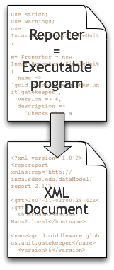

Inca reporters are executable programs and scripts, generally small, that test and report the health and characteristics of a system. Reporters can be executed automatically as part of an Inca installation or manually from a command line. Incorporating your own reporters into a running Inca installation requires only writing the reporters, including them in a repository, and configuring their execution in the Inca GUI tool, incat. More information about reporters and repositories is available in the latest user guide linked from <a href="/documentation">our documentation page</a>.

Most reporters are either version reporters that collect version information from a software package, unit test reporters that run a more involved functionality test, or performance benchmark reporters. The unit and version reporters cover software such as Grid middleware and tools, compilers, math libraries, data tools, and visualization tools. Current performance reporters measure data transfer and execute Grid benchmarks as described in <a href="/users#pubs">these linked papers</a>.

Other projects can submit reporter repositories to share with the Inca community by emailing <a href="mailto:inca@sdsc.edu">inca@sdsc.edu</a>.

