
The following are screenshots of Inca data consumers. For live examples, visit our <a href="/users">Inca users</a> page.

<ul>
	<li><a href="#map">Map View using Google Map API</a></li>
	<li><a href="#sum"> Tabular Suite Summary View</a></li>
	<li><a href="#detail">Test Detail View </a></li>
	<li><a href="#hist">Historical Views</a></li>
	<li><a href="#reports">Reports</a></li>
</ul>

<h3>Map View using Google Map API </h3>

The map view provides a summary view of the current status of resources on a Google map. For each resource, the summary view will provide the percentage of reports passed, number of passed reports, number of failed reports, and a list of the failed tests (with a link to the report details page). A resource is represented on the map as a marker and colored red, green, or orange based on the number of tests that have passed and/or failed. The figure below shows the Inca Google map view for the NEON testbed (four resources at SDSC and one resource at James Reserve). All resources are passing their tests so every resource marker is green.

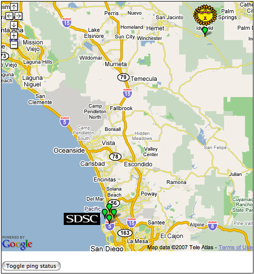

Clicking on a marker will display an info window with the name of the resource and the status information as show below.

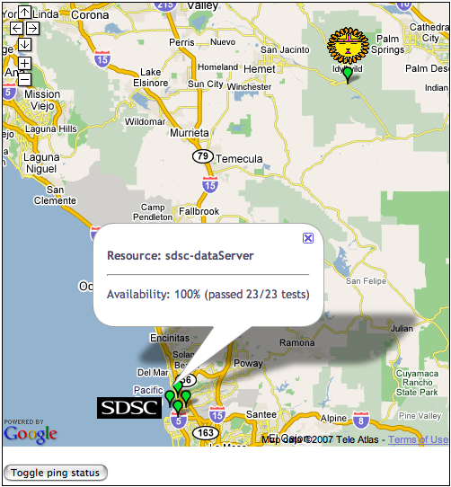

Clicking on the "Toggle ping status" button will display the status of the cross-site ping test as show below.

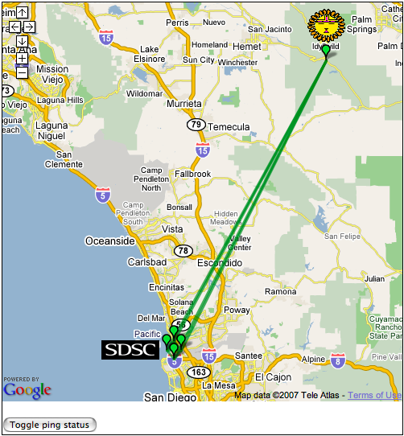

<h3>Tabular Suite Summary View </h3>

A summary table of test suite results with links to test detail pages:

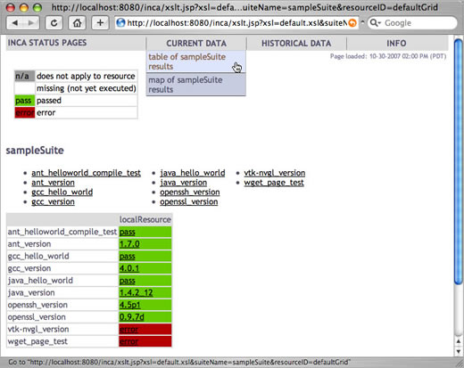

<h3>Test Detail View </h3>

Test execution detail view:

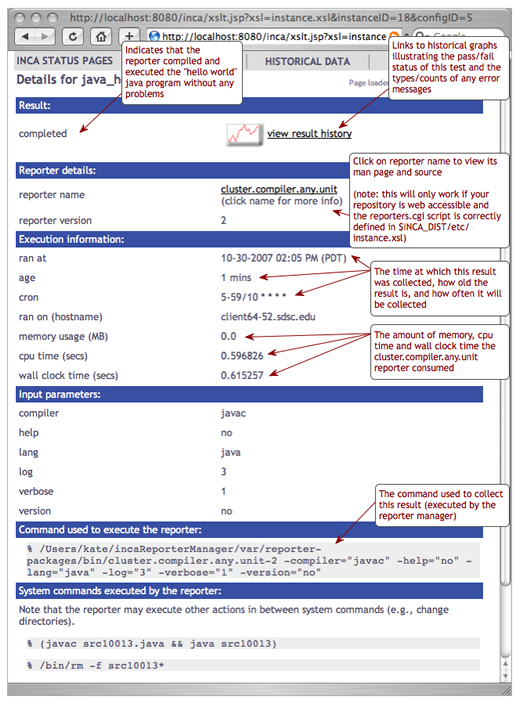

<h3>Historical Views </h3>

Customizable graphs of test status history and distribution of test error types:

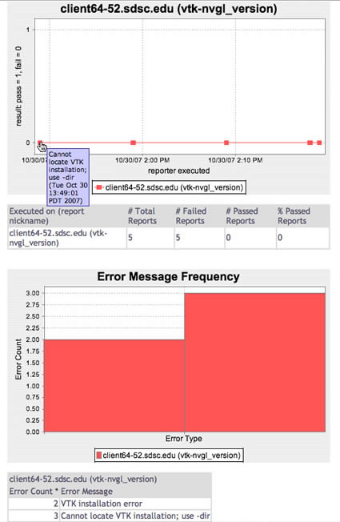

Customizable graphs of test status history and distribution of test error types:

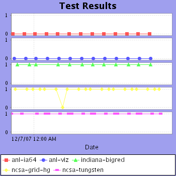

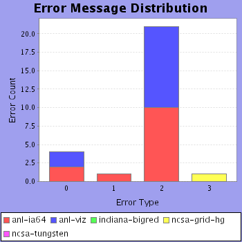

<h3>Reports </h3>

Historical summary reports with pass/fail status and error information:

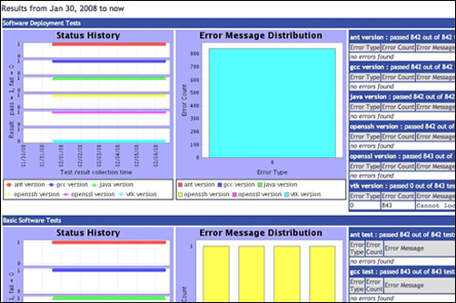

Average series pass rate by resource and suite for the past week. Each bar label shows the value of the average series pass rate for the last week and the difference in percentage from the previous week:

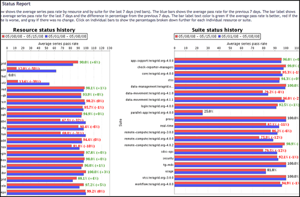

More detailed report for resource/suite (linked from report above):

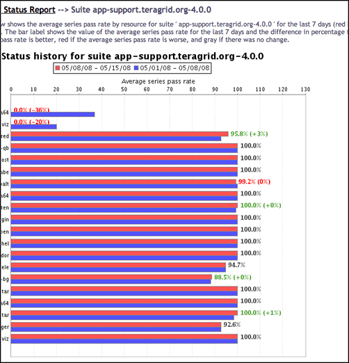

Summary of test series errors by time period. Each time period includes the number of errors for the series during the time period, the number of unique or distinct errors during the period, and the percentage of the total results that passed during the period:

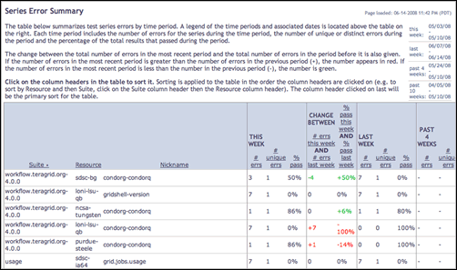

Average series pass rate over time grouped by resource and suite:

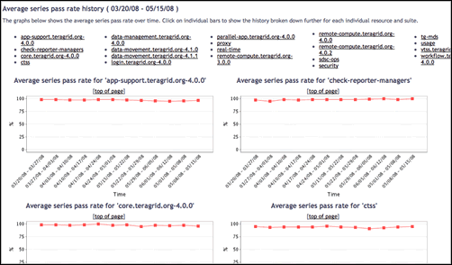

