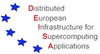
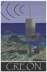

Grid projects using Inca:

<table>
	<tbody>
		<tr>
			<th>Inca User</th>
			<th>Public Status Pages</th>
			<th>Using Inca For</th>
		</tr>
		<tr valign="top">
			<td>

</td>
			<td><ul>
					<li><a href="http://inca.xsede.org/">XSEDE Inca status pages</a> 
					</li>
				</ul></td>
			<td>Monitoring of Common TeraGrid Software and Services (CTSS), resource registration in MDS, GRAM usage, and CA/CRL validity.</td>
		</tr>
		<tr valign="top">
			<td>

</td>
			<td>&nbsp;</td>
			<td>Grid, MDS, compiler, security and service tests</td>
		</tr>
		<tr valign="top">
			<td>

</td>
			<td>&nbsp;</td>
			<td>Software stack validation </td>
		</tr>
		<tr valign="top">
			<td>

</td>
			<td>(internal pages only)</td>
			<td>Software stack validation (DEISA Common Production Environment). Inca is shown in <a href="http://www.deisa.eu/publications/deisa-video">the DEISA overview video</a> during the ninth minute of the film. </td>
		</tr>
		<tr valign="top">
			<td>

</td>
			<td>(internal pages only)</td>
			<td>Software stack validation </td>
		</tr>
		<tr valign="top">
			<td>

</td>
			<td>(internal pages only)</td>
			<td>Software stack and services monitoring </td>
		</tr>
		<tr valign="top">
			<td>

</td>
			<td>(internal pages only)</td>
			<td><a href="http://www.dataturbine.org/">Data Turbine</a> monitoring </td>
		</tr>
		<tr valign="top">
			<td>

</td>
			<td>(internal pages only)</td>
			<td><a href="http://www.dataturbine.org/">Data Turbine</a> monitoring </td>
		</tr>
		<tr valign="top">
			<td>

</td>
			<td>(internal pages only)</td>
			<td>Web servers and database monitoring </td>
		</tr>
		<tr valign="top">
			<td>

</td>
			<td>(internal pages only)</td>
			<td>Monitoring HPC systems software </td>
		</tr>
		<tr valign="top">
			<td>

</td>
			<td>(internal pages only)</td>
			<td>Software stack validation, virtual machine validation, performance monitoring </td>
		</tr>
		<tr valign="top">
			<td>
<a href="http://www.ucgrid.org/">UC Grid</a>
</td>
			<td>(internal pages only)</td>
			<td> Monitoring of UC Grid portal, campus portals, and Grid appliances  </td>
		</tr>
		<tr valign="top">
			<td>

</td>
			<td><em>deployment in progress</em></td>
			<td> </td>
		</tr>
	</tbody>
</table>

Inca is also referenced in the below published papers:

<ul>
	<li>Liming, L., Navarro, J., Blau, E., Brechin, J., Catlett, C., Dahan, M., Diehl, D., Dooley, R., Dwyer, M., Ericson, K., Foster, I., Hanna, E., Hart, D. L., Jordan, C., Light, R., Martin, S., McGee, J., Pearlman, L., Reilly, J., Scavo, T., Shapiro, M., Smallen, S., Smith, W., and Wilkins-Diehr, N. 2009. <a href="http://doi.acm.org/10.1145/1658260.1658271">TeraGrid's integrated information service</a>. In Proceedings of the 5th Grid Computing Environments Workshop (Portland, Oregon, November 20 - 20, 2009). GCE '09. ACM, New York, NY, 1-10.</li>
	<li>Nicholas J. Wright, Shava Smallen, Catherine Olschanowsky, Jim Hayes and Allan Snavely. <a name="ipm" href="http://ipm-hpc.sourceforge.net/docs/Wright_PerformanceVariation.pdf">Measuring and Understanding Variation in Benchmark Performance</a>, <em>Dept of Defense High Performance Computing Users Group meeting</em>, June 2009.</li>
	<li>D. Fraser, S. Marru, S. Martin, N. Wilkins Diehr, I. Foster, S. Perera, Gateway Debug Team. Engaging with the LEAD Science Gateway Project: Lessons Learned in Successfully Deploying Complex System Solutions on TeraGrid, <em>TeraGrid '08</em>, June 2008.</li>
	<li>O. Khalili, J. He, C. Olschanowsky, A. Snavely, H. Casanova. <a name="grasp" href="http://ieeexplore.ieee.org/iel5/4100428/4100429/04100485.pdf?isnumber=4100429∏=STD&amp;arnumber=4100485&amp;arnumber=4100485&amp;arSt=293&amp;ared=300&amp;arAuthor=Khalili%2C+O.%3B+Jiahua+He%3B+Olschanowsky%2C+C.%3B+Snavely%2C+A.%3B+Casanova%2C+H.">Measuring the Performance and Reliability of Production Computational Grids</a>, <em>Proceedings of the 7th IEEE/ACM International Conference on Grid Computing</em>, pp.293-300, September 2006.</li>
	<li>M. Murray, S. Smallen, O. Khalili, and M. Swany. 2005. <a href="http://ieeexplore.ieee.org/iel5/10354/32950/01542759.pdf?tp=&amp;arnumber=1542759&amp;isnumber=32950">Comparison of End-to-End Bandwidth Measurement Tools on the 10GigE TeraGrid Backbone</a>, <em>Proceedings of the 6th IEEE/ACM international Workshop on Grid Computing</em>, November 2005.</li>
</ul>
